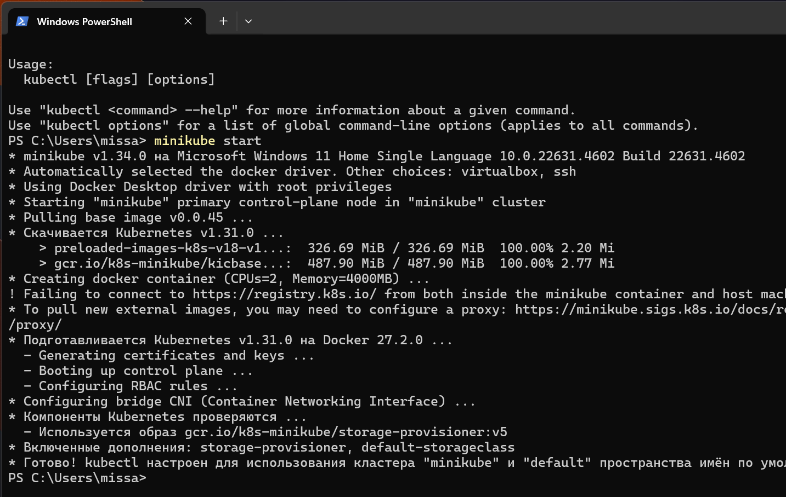

## Лабораторная работа №1 "Установка Docker и Minikube, мой первый манифест."

### Описание

Это первая лабораторная работа в которой вы сможете протестировать Docker, установить Minikube и развернуть свой первый "под".

### Цель работы

Ознакомиться с инструментами Minikube и Docker, развернуть свой первый "под".

### Ход работы

1. Установить Docker;
2. Установить Minikube;
3. Развернуть minikube cluster;
4. Скачать образ HashiCorp Vault;
5. Написать manifest для развертывания пода с образом HashiCorp Vault;
6. Создать сервис для доступа к данному контейнеру;
7. Прокинуть порт для доступа к контейнеру;
8. Найти токен для доступа к vault
9. Войти, используя токен.

### Выполнение работы

#### 1. Установка Docker

Docker — это платформа с открытым исходным кодом, которая позволяет разработчикам и системным администраторам автоматизировать развёртывание, масштабирование и управление приложениями в контейнерах.

Контейнеры — это изолированные среды, в которых приложения работают с необходимыми для них зависимостями (например, библиотеками, настройками окружения), что обеспечивает консистентность и портативность между различными окружениями.

Docker был скачен с официального сайта https://www.docker.com/ и установлен на операционную систему Windows 11.


#### 2. Установка Minikube

Minikube — это инструмент, который позволяет локально разворачивать и управлять кластером Kubernetes на одной машине. Minikube разворачивает одноузловый Kubernetes-кластер на устройстве, что позволяет тестировать приложения в Kubernetes-среде без необходимости настраивать кластер в облаке или в более сложной инфраструктуре.

Minikube был скачен с официального сайта https://minikube.sigs.k8s.io/docs/start/ и установлен на операционную систему Windows 11.

#### 3. Развертывание minikube cluster

Развертывание осуществлялось при помощи следующей команды:

```bash
minikebe start
```

Результат ее выполнения представлен ниже:


#### 4. Загрузка kubectl

Это основная утилита командной строки для работы с любым кластером Kubernetes. Основные команды:

```bash

# Просмотр подов
kubectl get pods

# Просмотр сервисов
kubectl get services

# Создание деплоймента
kubectl create deployment name --image=image-name

# Просмотр логов пода
kubectl logs pod-name

# Удаление ресурса
kubectl delete pod/service/deployment name

# Применение конфигурации из файла
kubectl apply -f filename.yaml
```


### И minikube kubectl

Это та же утилита kubectl, но встроенная в minikube. Используется, когда kubectl не установлен отдельно в системе.

```bash

# Запуск minikube
minikube start

# Остановка minikube
minikube stop

# Получение IP адреса minikube
minikube ip

# Открытие дашборда
minikube dashboard

# Проброс портов
minikube service service-name
```


#### 6. Создание сервиса для доступа к данному контейнеру

В начале нужно создать соотвествующей объект в кластере kurbernets, для этого используется следующая команда:

```bash
minikube kubectl -- apply -f vault-pod.yaml
```

Далее выполняется команда:

```bash
minikube kubectl -- expose pod vault --type=NodePort --port=8200
```

Данная команда создает сервис для пода vault. Сервис будет перенаправлять трафик на под vault через порт 8200. Результат выполнения команды представлен ниже:


#### 7. Осуществление входа при помощи найденного токена

Далее при помощи полученного токена был успешно осуществлен вход:


### Диаграмма организации


