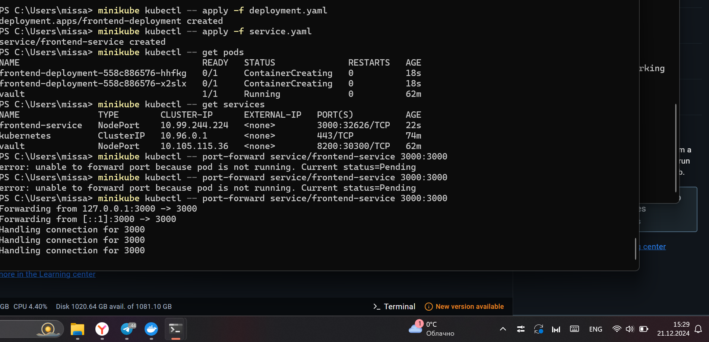
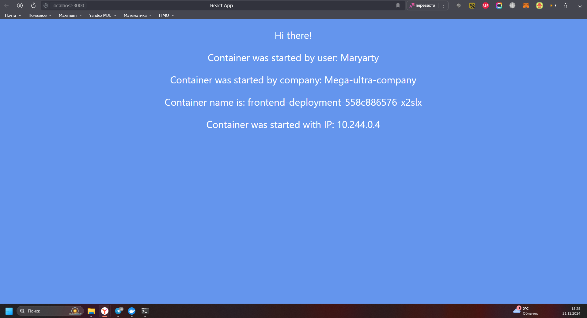
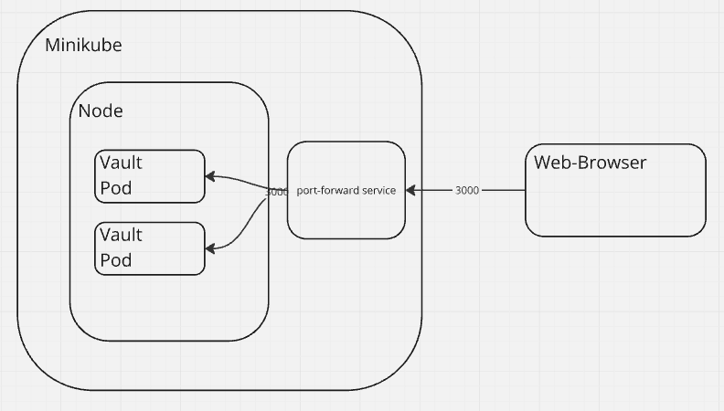

## Лабораторная работа №2 "Развертывание веб сервиса в Minikube, доступ к веб интерфейсу сервиса. Мониторинг сервиса."

### Цель работы

Ознакомиться с типами "контроллеров" развертывания контейнеров, ознакомится с сетевыми сервисами и развернуть свое веб приложение.

### Ход работы

1. Создать `deployment` с 2 репликами контейнера [ifilyaninitmo/itdt-contained-frontend:master](https://hub.docker.com/repository/docker/ifilyaninitmo/itdt-contained-frontend) и передать переменные в эти реплики: `REACT_APP_USERNAME`, `REACT_APP_COMPANY_NAME`.
2. Создать сервис через который будет доступ на эти "поды". Выбор типа сервиса остается на ваше усмотрение.
3. Запустить в `minikube` режим проброса портов и подключиться к контейнерам через веб браузер.
4. Проверить на странице в веб-браузере переменные `REACT_APP_USERNAME`, `REACT_APP_COMPANY_NAME` и `Container name`. Изменяются ли они? Если да то почему?
5. Проверить логи контейнеров, приложите логи в отчёт.

### Выполнение работы

#### 1. Создание Deployment

В Kubernetes Deployment — это объект, который управляет развертыванием и обновлением реплик подов (Pods). Он представляет собой контроллер, позволяющий автоматически создавать и поддерживать нужное количество подов с нужными версиями контейнеров. Основные задачи Deployment — обеспечить надежное и предсказуемое развертывание, обновление и откат версий приложений.

В начале создается [конфигурационной файл](./deployment.yaml), в нем задается тип объекта `kind`, его идентификатор `name`, количество реплик `replicas`, а также спецификация контейнеров, которая включается в себя образ `image`, имя контейнера `name`, и переменные окружения `env`.

Для создания объекта Deployment в Kubernates была использована следующая команда:

```bash
minikube kubectl -- apply -f deployment.yaml
```

В результате после выполнения данной команды были созданы два pods и объект deployment.

#### 2. Проброс портов

Для проброса портов была выполнена следующая команда:

```bash
minikube kubectl -- port-forward service/lab2-service 3000:3000
```



#### 3. Проверка в браузере

При переходе по адресу `localhost:3000` открывается следующая страница:

Переменные `REACT_APP_USERNAME` и `REACT_APP_COMPANY_NAME` не изменяются, так как это переменные среды, которые были заданы при создании объекта deployment, обе эти переменные соовтественно описаны в файле [deployment.yaml](deployment.yaml). Переменная `Container name`, может изменяться в зависимости от того, к какому из контейнеров произошла переадресация из браузера. В данной работе переадресация происходила к одному и тому же контейнеру.

#### 4. Проверка логов контейнера

Логи обоих контейнеров представлены ниже:


### Диаграмма организации


